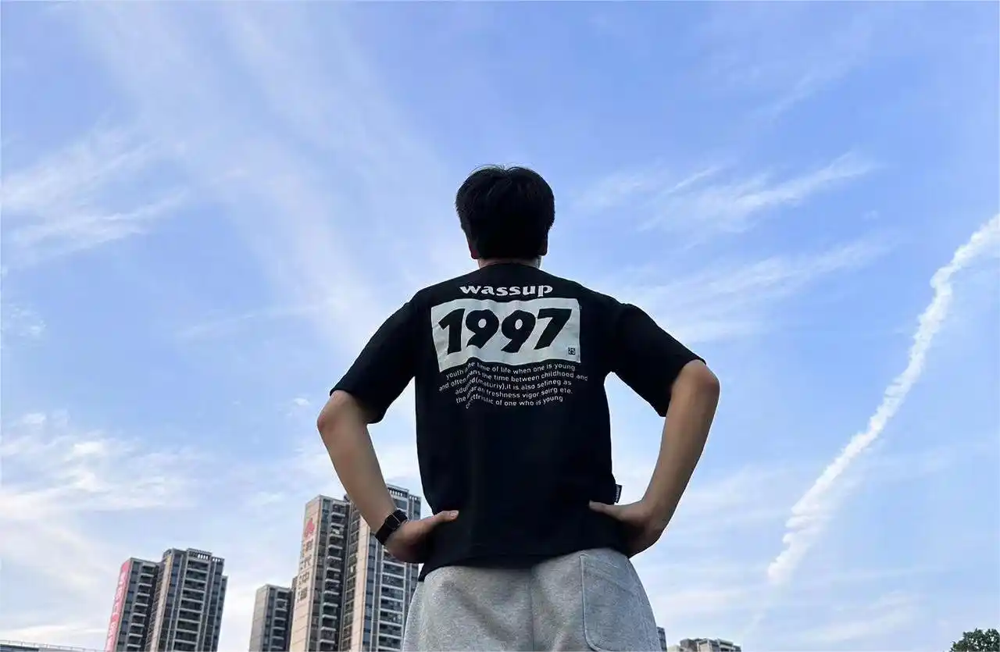

  

    t
    i
    n
    y
    o
  

  

    d
    o
    c
    s
  

# Tinyo Docs
<!-- # 关于我

## tinyo

- tiny - 小
- o - 黑

大家好，我是tinyo。 -->

<!-- 诞生于1997, 喜欢唱, 不喜欢跳和rap的潮汕男孩。 -->

<!-- ## slogan -->
进步是没有尽头的，但是它却留有痕迹！

<!-- **运动不止，生生不息。昂首向前，学无止境。** 
记录学习，记录问题，进步是没有尽头的，但是它却留有痕迹！

在这里，我会以板块划分，同时留下我生活的痕迹，项目的痕迹，遇到困难的窘境。 
等我回过头来看时，会发现其内涵是如此饱满，填满我的生活。 -->

## 我的作品

元计划官方网站: [-**点击跳转**](http://www.yuanjihua.art) 
codefun官方网站:  [-**点击跳转**](https://www.code.fun) 
tinyo个人网站:  [-**点击跳转**](http://43.139.113.7:81/) 
tinyo个人文档: [跳转至文章](http://43.139.113.7:89/article/) 
小程序搜索: **yzfcool** 
个人公众号: **不要只会想和说**

## 常用网站
Bing [点击跳转](https://cn.bing.com/?FORM=BEHPTB) 
Github [点击跳转](https://github.com/) 
PNG/JPG图片高效压缩 [TinyPNG](https://tinypng.com/) 
Ant Design Vue组件库 [Ant Design Vue](https://www.antdv.com/components/icon-cn) 
Ant Design React组件库 [Ant Design React](https://4x.ant.design/components/overview-cn/) 
Ant Design Mobile组件库 [Ant Design Mobile](https://mobile.ant.design/zh/guide/quick-start/) 
Vant UI组件库 [Vant UI](https://vant-contrib.gitee.io/vant/#/zh-CN) 
有道词典翻译 [点击跳转](https://fanyi.youdao.com/index.html#/) 
微信公众平台 [点击跳转](https://mp.weixin.qq.com/) 
GTP3.5免费试用 [点击跳转](https://chat.wuguokai.cn/)

## 联系我

WeChat: yzfcoo1 
QQ: 986191391 

<!-- ## 一段很喜欢的歌词

微风需要竹林 溪流需要蜻蜓 
消愁般的离开需要片片浮萍 
记得那年的雨季 回忆里特安静 
哭过后的决定 是否还能进行 
我傻傻等待 傻傻等春暖花开 
等终等于等明等白 等爱情回来 
青春属于表白 阳光属于窗台 
而我想我属于一个拥有你的未来 

纸上的彩虹 用素描画的钟 
我还在修改 回忆之中你的笑容 
该怎么去形容 为思念酝酿的痛 
夜空霓虹 都是我不要的繁荣 
或许去趟沙滩 或许去看看夕阳 
或许任何一个可以想心事的地方 
情绪在咖啡馆 被调成一篇文章 
彻底爱上你如诗一般透明的泪光 -->
