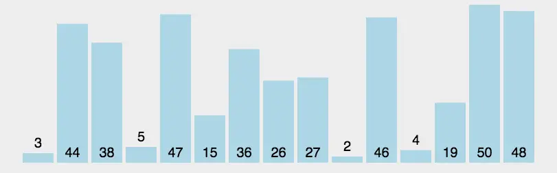

# 排序


## 冒泡排序


动图示例：


平均时间复杂度：O(N^2)<br>
最佳时间复杂度：O(N)<br>
最差时间复杂度：O(N^2)<br>
空间复杂度：O(1)

常规写法：
```js
function bubbleSort (arr) {
    for (let i = 0; i < arr.length - 1; i++) {
        for (let j = 0; j < arr.length - 1 - i; j ++) {
            if (arr[j + 1] < arr[j]) {
                let temp = arr[j + 1];
                arr[j + 1] = arr[j];
                arr[j] = temp;
            }
        }
    }
    return arr;
}
```

加入优化：

```js
function bubbleSort (arr) {
    for (let i = 0; i < arr.length - 1; i++) {
        let lock = false;
        for (let j = 0; j < arr.length - 1 - i; j ++) {
            if (arr[j + 1] < arr[j]) {
                let temp = arr[j + 1];
                arr[j + 1] = arr[j];
                arr[j] = temp;
                lock = true;
            }
        }
        if (!lock) return arr;
    }
    return arr;
}
```


## 选择排序


动图示例：


平均时间复杂度：O(N^2)<br>
最佳时间复杂度：O(N^2)<br>
最差时间复杂度：O(N^2)<br>
空间复杂度：O(1)


常规写法：
```js
function selectSort (arr) {
    for (let i = 0; i < arr.length - 1; i++) {
        let minIndex = i;
        for (let j = i + 1; j < arr.length; j++) {
            if (arr[j] < arr[minIndex]) {
                minIndex = j
            }
        }
        let temp = arr[i];
        arr[i] = arr[minIndex];
        arr[minIndex] = temp;
    }
    return arr;
}
```


## 插入排序


动图示例：


平均时间复杂度：O(N^2)<br>
最差时间复杂度：O(N^2)<br>
空间复杂度：O(1)


```js
function insertSort (arr) {
    for (let i = 1; i < arr.length; i++) {
        let val = arr[i];
        let j = i - 1;
        while (j >= 0 && arr[j] > val) {
            arr[j + 1] = arr[j]
            j--;
        }
        arr[j + 1] = val;
    }
    return arr;
}
```


## 快速排序


快速排序使用分治法（Divide and conquer）策略来把一个序列（list）分为两个子序列（sub-lists）。

- 从数列中挑出一个元素，称为 “基准”（pivot），
- 重新排序数列，所有元素比基准值小的摆放在基准前面，所有元素比基准值大的摆在基准的后面（相同的数可以到任一边）。在这个分区退出之后，该基准就处于数列的中间位置。这个称为分区（partition）操作。
- 递归地（recursive）把小于基准值元素的子数列和大于基准值元素的子数列排序

平均时间复杂度：O(NlogN)<br>
最佳时间复杂度：O(NlogN)<br>
最差时间复杂度：O(N^2)<br>
空间复杂度：根据实现方式的不同而不同


动图示例：



```js
function quickSort (arr) {
    if (arr.length <= 1) return arr;

    let midVal = arr.splice(Math.floor(arr.length / 2), 1)[0];
    let leftArr = [];
    let rightArr = [];

    for (let i = 0; i < arr.length; i++) {
        if (arr[i] < midVal) {
            leftArr.push(arr[i]);
        } else {
            rightArr.push(arr[i])
        }
    }

    return quickSort(leftArr).concat(midVal, quickSort(rightArr));
}
```

## 归并排序

归并排序，是创建在归并操作上的一种有效的排序算法。算法是采用分治法（Divide and Conquer）的一个非常典型的应用，且各层分治递归可以同时进行。归并排序思路简单，速度仅次于快速排序，为稳定排序算法，一般用于对总体无序，但是各子项相对有序的数列。

归并排序是用分治思想，分治模式在每一层递归上有三个步骤：

- 分解（Divide）：将n个元素分成个含n/2个元素的子序列。
- 解决（Conquer）：用合并排序法对两个子序列递归的排序。
- 合并（Combine）：合并两个已排序的子序列已得到排序结果。

平均时间复杂度：O(NlogN)<br>
空间复杂度：O(N)<br>


动图示例：


```js
function mergeSort (arr) {
    if (arr.length <= 1) return arr;
    let midIndex = Math.floor(arr.length / 2);
    let leftArr = arr.slice(0, midIndex);
    let rightArr = arr.slice(midIndex);

    return merge(mergeSort(leftArr), mergeSort(rightArr));
}

function merge (leftArr, rightArr) {
    let result = [];
    let i = 0, j = 0;

    while(i < leftArr.length && j < rightArr.length) {
        if (leftArr[i] < rightArr[j]) {
            result.push(leftArr[i]);
            i++;
        } else {
            result.push(rightArr[j]);
            j++;
        }
    }
    return result.concat(leftArr.slice(i), rightArr.slice(j));
}
```