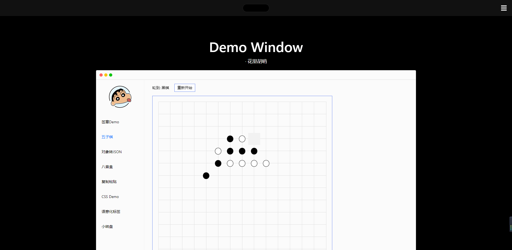

# 个人网站

## 技术栈

个人网站的技术栈有很多个版本，最开始是使用react进行编写的，后面换成了vue2来写，最后换成了 vue3+ts 的模式来编写。这里以 vue3+ts 的版本进行介绍。

```json
// 部分依赖
"dependencies": {
  "vue": "^3.2.13",
  "vue-class-component": "^8.0.0-0",
  "vue-router": "^4.0.3",
  "vuex": "^4.0.0",
  "typescript": "~4.5.5"
}
```

## 首页

<strong>#首屏区域</strong>


- 进入页面时首屏的文字输入显示效果, 文字最右侧光标闪烁效果。
- 点击钢铁侠胸口的反应堆，小彩蛋。
- 首页往下滚动大约50px的距离后，顶部的导航栏动态显示。此处做了节流的处理，避免频繁触发页面滚动方法。

<strong>#轮播图区域</strong>


- 区别于常规的轮播图，鼠标拖动图片区域或者滑块区域都可以切换轮播图。
- 鼠标悬停时轮播图自动轮播停止，离开后恢复。
- 绑定鼠标的mouseDown事件，记录down时鼠标的x/y坐标点，在mousedown事件中对document添加mousemove和mouseup事件监听函数，move移动时通过down记录下的x/y坐标可以判断出当前鼠标位移的距离和方向，每100的距离切换一张图片，再加入判断是否为第一张或最后一张图片的判断，最终完成拖动图片切换图片的功能。在mouseup事件中解除document对mousemove和mouseup的事件监听，释放内存避免内存泄露。
- 拖动滑块切换图片的实现思路和拖动图片是一致的，只不过需要加入滑块相对于轨道左右两侧的距离判断，让滑块始终保持早轨道中。
- 该组件抽离成了公用的组件，可接受的参数有图片的数据，轮播卡片层叠的个数，轮播图切换的时间间隔。开箱即可使用！


<strong>#demoWindow区域</strong>



在这里集合了我以前没事玩玩记录下的一些demo，做成了一个mac window的形状。
- 签章demo算是我最早接触鼠标事件的一个demo玩具，右侧可以通过select选择自己需要的"盖章"，然后将盖章拖入到指定区域内，记录对应的坐标等。
- 五子棋是一个小游戏，每一个格子都是一个坐标，最主要的逻辑就是每落下一个棋子会判断当前横竖和倾斜总共4个方向上是否存在连续相同的5个棋子，满足条件则提示获胜。
- 对象转JSONdemo，不知道怎么想出来的
- 复制粘贴看到时觉得是一个值得记录的功能点，使用的场景也比较多。主要就是利用Selection API/Range API
```javascript
// 选中要复制的文字区域
const selection = window.getSelection()
const range = document.createRange()
const element = this.$refs.selectText
range.selectNodeContents(element) // RangeAPI: 制造区域
selection && selection.addRange(range) // Selection: 选中区域

// 执行以下方法，实现复制
document.execCommand('copy')
const selection = window.getSelection()
```
- CSS demo就是想着单纯记录觉得有意思的css效果，去外面的世界逛一下，会发现这些都是小儿科。
- 语义化标签的页面，所有的文字都是通过h1-h5的标签来显示层级的，通过获取最外层的DOM区域，递归遍历DOM区域内的所有节点，最后获得一棵树状结构的数据。点击生成目录后将数据按照层级结构缩进显示。
- 点击开始抽奖后转盘开始转动，点击确定后会随机获得一个最终角度，在delay一段时间后通过定时器的操作来控制指针的旋转速度直至速度变为0停在对应的角度。
- 顶部栏右侧icon点击后会出现导航栏，利用css的动画实现了导航栏的动态显示和消失的效果，费劲心思只求帅气！(动画灵感来自于win10系统的chrome打开打印弹窗的显示效果。), 点击关闭时使用定时器延时0.5s触发，然后每一个文字单独设置触发的动画延迟, 从0.1-0.5逐个设置。


## ScrollAnimate页面

灵感来源是苹果官网的产品宣传页，页面会随着页面的滚动而执行对应的动画效果，看起来就酷炫无比。要让浏览器能够滚动起来，首先需要有足够的高度，然后再将需要执行动画的区域粘在顶部，让这一块区域的大小刚好为满屏。

粘在顶部的操作可以使用`position: sticky`的css属性来实现，动画的效果当然是用transform来定义。当区域内的动画显示完成后，区域的高度也达到了临界点，这样就可以无缝的将下一块需要展示的区域继续显示。

在mounted生命周期中，添加scroll的事件监听函数，通过`document.documentElement.scrollTop`来获取当前滚动位置与浏览器顶部的距离，以此来控制并编写某一段区域的显示效果等。在unmounted生命周期函数中将绑定的scroll事件销毁。滚动到一定位置后，假设用户刷新了页面，也需要让动画展示到对应的位置效果，所以需要将当前动画显示数据存储起来，这里做的处理是存在sessionStorage中，在created生命周期函数中获取并写入到数据中。

实现的思路根据自己想的来做的，可能有点稚嫩，但我觉得该页面最难的不是如何实现效果，而是动画效果怎么展示更优雅好看高端大气...


## Viewport页面


起因是我有一个树状的JSON数据，这个数据机构类似于虚拟DOM，每一个节点都记录了节点的属性和结构。基于这些，用了一个递归的方式将整个树进行遍历，最后渲染成图中的样子。

页面结构分为三个部分，顶部栏，左侧节点树，右侧操作区域(viewport)。功能点可细分为以下几点：
- viewport区域鼠标悬停时节点高亮，利用事件代理的机制将mouseover事件绑定在最外层的dom上，当方法触发时可以获取当前鼠标悬停位置对应的dom信息(宽高定位信息)，以此来定位且高亮节点。
- viewport区域鼠标点击选中时高亮，原理和第一点类似，选中高亮和悬停高亮的数据分别存放在两个数组变量中，在特定位置中遍历数组信息，渲染出高亮的效果。
- viewport区域可以进行拖拽移动，结合了mousedown/mousemove/mouseup三种方法，大概为down的时候记录鼠标位置，move的时候根据记录的坐标判断出鼠标位移值，从而修改viewport的定位信息。
- 节点树节点选中时viewport区域对应节点高亮，在节点选中时触发的方法中获取当前节点的id，根据id在viewport中找到节点并获取节点的dom信息，从而进行高亮处理。同理在viewport区域中选中节点时，也可以根据节点的id来找到节点树中对应的节点，从而进行选中操作。
- 顶部操作栏的放大缩小恢复默认操作，通过变量来控制viewport的scale缩放大小。


## AboutTinyo页面


这个页面其实就是我的简历，把我的简历在网页中渲染了出来，方便查看的同时也方便我持续修改我的简历。在顶部栏中还附加了一些操作方法，例如: 放大，缩小，打印，在线编写等。

- 放大缩小，通过控制变量来控制scale属性的数值，从而来控制页面的缩放。
- 打印，调用浏览器自带的打印方法`window.print`即可调用打印的功能，浏览器自带的打印也有相应的钩子函数，`onbeforeprint`和`onafterprint`, 在`onbeforeprint`打印前的钩子中将顶部导航栏隐藏，onafterprint打印后再让其反显，从而让打印的效果更符合个人预期，当然，在这些钩子中可以执行一些自定义方法等。
- 在线编辑，原理就是设置`document.designMode = on || off`, 设置为on后即可编辑内容。设置为off时关闭。
- 点击打印后另存为pdf就可以生成可用的简历了！
- 编辑状态下可点击头像更换图片，实现的方法如下:
```javascript
// 创建input标签，type设置为为file，模拟点击后上传图片文件
const uploadInput = document.createElement('input')
uploadInput.setAttribute('type', 'file')
uploadInput.setAttribute('accept', 'image/*')
uploadInput.setAttribute('name', 'fujian')
uploadInput.click()
uploadInput.onchange = () => {
  const file = uploadInput.files[0]
  const reader = new FileReader()
  reader.readAsDataURL(file)
  reader.onload = e => this.$refs.personIcon.src = e.target.result
  uploadInput.remove()
}
```

## JobBoard页面


工作经历一直都是以敏捷开发为主，敏捷开发当然离不开看板了。页面比较简洁，只做了一个简单的看板demo。每一列被分为不同的状态，每个状态下都有不同的任务卡片，当对应的任务进入下一阶段后，即可拖动对应的卡片进入对应的状态列，从而同步任务进度。

- 主数据的数据结构为二维数组，列数是由主数据的数组长度决定的，每一张卡片都是一个对象，描述着卡片的状态信息。
- 要将卡片从一个状态切换到另一个状态，只需要将卡片信息中的状态变量修改为对应值即可。
- 拖拽的实现通过dragstart，dragover，drop方法来实现。在卡片上绑定dragstart方法，捕获用户的拖拽开始动作，在每一列中分别绑定dragover和drop方法，捕获用户在对应列上移动和松开鼠标动作，松开鼠标后将对应卡片信息中的状态修改为当前列对应的状态，即可实现该功能。
- dragover方法上主要代码为`e.preventDefault()`，用于取消“拖拽卡片在浏览器中松开鼠标后会弹回”的默认事件(不同的操作系统问题可能不同)。


## DynamicTable页面


灵感来源于工作，需求需要制作一个用户可以自定义结构和数据的表单，最主要的功能是前四列(可删减，最少一列最多四列)可以需要进行一个竖向单元格合并的一个操作。

原理：每一行数据都会有自己的id，根据记录唯一id来控制单元格的合并。
- 假设用户点击行A中第一列的加号按钮时，会在行A下一行新增一条行数据，该行的数据都为空。
- 假设用户点击行A中第二列的加号按钮时，会在行A下一行新增一条行B数据，行B的第一列数据为行A的第一列数据，其他数据为空，同时记录一个标识字段level1Id，该字段为行A的id。当行数据存在level1Id字段时，则代表当前行的第一列数据存在合并的情况，合并的初始行就是该字段记录的id所对应的行。
- 假设用户点击行A中第三列的加号按钮时，会在行A下一行新增一条行B数据，行B的第一列数据为行A的第一列数据，行B的第二列数据为行A的第二列数据，其他数据为空，同时记录标识字段level1Id和level2Id，两个字段记录的都是行A的id。当行数据存在level1Id字段时，则代表当前行的第一列数据存在合并的情况，当行数据存在level2Id字段时，则代表当前行的第二行数据存在合并的情况。合并的初始行就是该字段记录的id所对应的行。
- 以此类推

至此，只是为了在进行用户操作时记录下合并的标识。

当我们在初始化数据时，还需要遍历数据，对所有需要合并的数据进行一个整合，统计出需要合并的行的起始位置及长度。具体是这样操作的：

- 遍历数据，对需要合并的列的数据进行一个统计（前四列）
- 定义了一个cellConfig对象变量，用于记录起始行和长度数据
- 每遍历一行都会进行四次判断操作。
- 第一次判断行数据是否存在level1Id字段，如果存在则取level1Id字段数据否则取id字段数据做为key值，然后在cellConfig对象中判断是否存在该key数据，如果存在则将该数据进行+1操作，否则将数据作为cellConfig对象的key且值设置为1。(`${level1Id || id}`)
- 第二次判断行数据cellConfig对象中是否存在(`${level1Id || id}-${level2Id || id}`)字段，如果存在则将该数据进行+1操作，否则将数据作为cellConfig对象的key且值设置为1。
- 第三次判断行数据cellConfig对象中是否存在(`${level1Id || id}-${level2Id || id}-${level3Id || id}`)字段, 如果存在则将该数据进行+1操作，否则将数据作为cellConfig对象的key且值设置为1。
- 第四次判断行数据cellConfig对象中是否存在(`${level1Id || id}-${level2Id || id}-${level3Id || id}-${level4Id || id}`)字段, 如果存在则将该数据进行+1操作，否则将数据作为cellConfig对象的key且值设置为1。

遍历了以后就可以得到一个cellConfig的对象数据，在antDesignVue组件库的Table组件中，根据配置columns的customCell字段，就可以控制单元格的合并，customCell接收一个对象，对象内的rowSpan即为合并的格子数量。在生成columns数据时通过对当前行数据的获取，可以读取到cellConfig中对应的值，根据当前行的下标判断当前行是否为起始行，如果不是则设置rowSpan为0，如果是则将其设置为合并的总长度。

基于此描述，就可以大致将该功能点实现，不过缺陷还是有的，假如未来需要引入第五第六列的合并列，就不得不再一次对代码进行维护了。而且代码相对较复杂，后期维护起来也比较麻烦。


<!-- 
| 生命周期        | 描述           |             |
| ------------- |:-------------:|
| setup | 开始创建组件之前，在 beforeCreate 和 created 之前执行，创建的是 data 和 method |
| onBeforeMount   | 在组件挂载到页面之前被调用   |
| onMounted | 在组件挂载到页面后被调用   |
| onBeforeUpdate | 在组件更新之前调用 |
| onUpdated | 在组件更新之后调用  |
| onBeforeUnmount | 在组件销毁之前调用     |
| onUnmounted |  在组件销毁之后调用  |
| onErrorCaptured | 可以获取子孙组件抛出的错误信息，如果需要处理组件函数中的错误，就可以在此钩子函数内部进行处理。请注意，这个钩子只能捕获该组件的儿子或孙子组件所发生的错误，而不是其他组件的错误。  | -->

