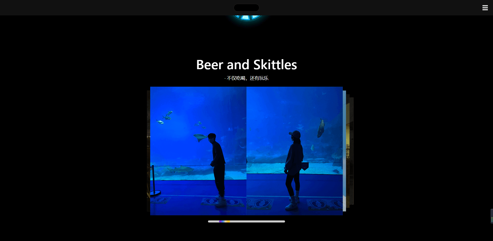
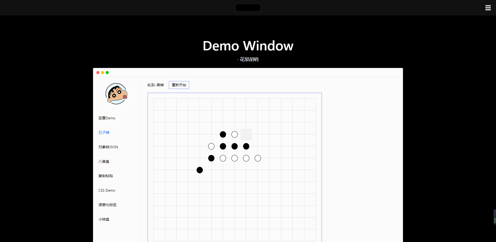

# 简历项目描述

## #个人网站

### 技术栈

个人网站的技术栈有很多个版本，最开始是使用react进行编写的，后面换成了vue2来写，最后换成了 vue3+ts 的模式来编写。这里以 vue3+ts 的版本进行介绍。

```json
// 部分依赖
"dependencies": {
  "vue": "^3.2.13",
  "vue-class-component": "^8.0.0-0",
  "vue-router": "^4.0.3",
  "vuex": "^4.0.0",
  "typescript": "~4.5.5"
}
```

### 首页
<br>

<strong>#首屏区域</strong>


1. 进入页面时首屏的文字输入显示效果, 文字最右侧光标闪烁效果。
2. 点击钢铁侠胸口的反应堆，小彩蛋。
3. 首页往下滚动大约50px的距离后，顶部的导航栏动态显示。此处做了节流的处理，避免频繁触发页面滚动方法。

<strong>#轮播图区域</strong>



1. 区别于常规的轮播图，鼠标拖动图片区域或者滑块区域都可以切换轮播图。
2. 鼠标悬停时轮播图自动轮播停止，离开后恢复。
3. 绑定鼠标的mouseDown事件，记录down时鼠标的x/y坐标点，在mousedown事件中对document添加mousemove和mouseup事件监听函数，move移动时通过down记录下的x/y坐标可以判断出当前鼠标位移的距离和方向，每100的距离切换一张图片，再加入判断是否为第一张或最后一张图片的判断，最终完成拖动图片切换图片的功能。在mouseup事件中解除document对mousemove和mouseup的事件监听，释放内存避免内存泄露。
4. 拖动滑块切换图片的实现思路和拖动图片是一致的，只不过需要加入滑块相对于轨道左右两侧的距离判断，让滑块始终保持早轨道中。
5. 该组件抽离成了公用的组件，可接受的参数有图片的数据，轮播卡片层叠的个数，轮播图切换的时间间隔。开箱即可使用！


<strong>#demoWindow区域</strong>



1. 在这里集合了我以前没事玩玩记录下的一些demo，做成了一个mac window的形状。
2. 签章demo算是我最早接触鼠标事件的一个demo玩具，右侧可以通过select选择自己需要的"盖章"，然后将盖章拖入到指定区域内，记录对应的坐标等。
3. 五子棋是一个小游戏，每一个格子都是一个坐标，最主要的逻辑就是每落下一个棋子会判断当前横竖和倾斜总共4个方向上是否存在相同的5个棋子，有则获胜。
4. 对象转JSONdemo，不知道怎么想出来的
5. 复制粘贴看到时觉得是一个值得记录的功能点，使用的场景也比较多。主要就是利用Selection API/Range API
```javascript
// 选中要复制的文字区域
const selection = window.getSelection()
const range = document.createRange()
const element = this.$refs.selectText
range.selectNodeContents(element) // RangeAPI: 制造区域
selection && selection.addRange(range) // Selection: 选中区域

// 执行以下方法，实现复制
document.execCommand('copy')
const selection = window.getSelection()
```
6. CSS demo就是想着单纯记录觉得有意思的css效果，去外面的世界逛一下，会发现这些都是小儿科。
7. 语义化标签的页面，所有的文字都是通过h1-h5的标签来显示层级的，通过获取最外层的DOM区域，递归遍历DOM区域内的所有节点，最后获得一棵树状结构的数据。点击生成目录后将数据按照层级结构缩进显示。
8. 点击开始抽奖后转盘开始转动，点击确定后会随机获得一个最终角度，在delay一段时间后通过定时器的操作来控制指针的旋转速度直至速度变为0停在对应的角度。
9. 顶部栏右侧icon点击后会出现导航栏，利用css的动画实现了导航栏的动态显示和消失的效果，费劲心思只求帅气！(动画灵感来自于win10系统的chrome打开打印时弹窗的显示效果。), 点击关闭时使用定时器延时0.5s触发，然后每一个文字单独设置触发的动画延迟, 从0.1-0.5逐个设置。